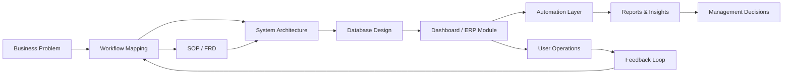

<!--
  GitHub Profile README
  Owner: Abhinand / abzops
  Theme: AI Operations Architect | ERP Automation | Systems Builder
-->

<div align="center">

  

  <br />

  

  <br /><br />

  <a href="https://linkedin.com/in/abzops">
    
  </a>
  <a href="mailto:opsintern@stacknstock.in">
    
  </a>
  <a href="https://github.com/abzops">
    
  </a>
  

</div>

<br />

<div align="center">

  
  
  
  
  
  

</div>

---

# ⚡ Digital Operations Command Center

<table>
<tr>
<td width="60%" valign="top">

## 👋 About Me

I’m **Abhinand**, a systems-focused builder working across **AI-assisted development, ERP workflows, automation, procurement systems, inventory management, CRM dashboards, and internal business tools**.

My core strength is converting real company operations into **structured, scalable, and execution-ready digital systems**.

I like building tools that are:

- simple for teams to use
- clean for developers to maintain
- connected across workflows
- ready for automation
- useful for management decisions

> **I don’t just build screens. I build operating systems for business workflows.**

</td>
<td width="40%" valign="top">

## 🧠 Builder Identity

```yaml
name: Abhinand
handle: abzops
mode: Systems Builder

focus:
  - ERP automation
  - Inventory systems
  - Procurement intelligence
  - Internal tools
  - AI-assisted development

principles:
  - Clarity before code
  - Workflow before UI
  - Automation before repetition
  - Execution before perfection
```

</td>
</tr>
</table>

---

## 🛰️ What I Build

<div align="center">

<table>
<tr>
<td align="center" width="25%">
  
  <br /><br />
  GRN, MIV, MRN, stock movement, bin register, dispatch tracking.
</td>
<td align="center" width="25%">
  
  <br /><br />
  ERPNext, Frappe, Zoho, approvals, modules, SOPs and FRDs.
</td>
<td align="center" width="25%">
  
  <br /><br />
  Supabase dashboards, KPI cards, clean data views and reporting.
</td>
<td align="center" width="25%">
  
  <br /><br />
  Prompt systems, vibe coding, AI implementation and automation planning.
</td>
</tr>
</table>

</div>

---

## 🧬 Operating System Map



---

## 🏗️ Current Build Zones

<table>
<tr>
<td width="50%" valign="top">

### 📦 Stack n Stock / IMS Thinking

```txt
GRN  -> Inventory Update
MIV  -> Material Issue
MRN  -> Material Return
Bin  -> Location-Level Control
PO   -> Procurement Linkage
WIP  -> Conversion Tracking
```

I work on systems where every stock movement should be traceable, every purchase should connect to operations, and every dashboard should show what matters.

</td>
<td width="50%" valign="top">

### ⚙️ ERP + Automation Thinking

```txt
Requirement -> Workflow -> Module
Module      -> Data Model -> UI
UI          -> Automation -> Report
Report      -> Decision -> Improvement
```

I focus on turning operational requirements into ERP-ready flows, clean documentation, and automation-friendly execution paths.

</td>
</tr>
</table>

---

## 🛠️ Tech Arsenal

<div align="center">

### Core Web & Programming


<br /><br />

### Frontend, App & UI


<br /><br />

### Backend, Database & Cloud


<br /><br />

### Dev Tools & Workflow


</div>

---

## 🧠 Skill Matrix

<div align="center">

| Domain | What I Do | Tools / Concepts |
|---|---|---|
| **ERP Systems** | Module planning, workflow mapping, FRD/SOP creation | ERPNext, Frappe, Zoho |
| **Inventory Systems** | Stock flow, GRN, MIV, MRN, bin register | IMS logic, database design |
| **Procurement Ops** | PO tracking, vendor comparison, sourcing analysis | Sheets, dashboards, reports |
| **Automation** | Webhooks, workflow bots, status updates | Zoho Flow, Cliq, APIs |
| **Dashboards** | KPI cards, operational views, management reports | Supabase, SQL, JS |
| **AI Execution** | Prompt systems, AI planning, vibe coding workflows | Codex, Claude Code, AI IDEs |

</div>

---

## 🧩 Project Architecture Style

<table>
<tr>
<td width="33%" align="center">

### 01  
### Discover

Understand the actual workflow, users, data points, approvals, and business pain.

</td>
<td width="33%" align="center">

### 02  
### Design

Convert the workflow into modules, database structure, UI screens, and automation logic.

</td>
<td width="33%" align="center">

### 03  
### Deploy

Build, test, document, automate, improve, and make the system usable for real teams.

</td>
</tr>
</table>

---

## 📊 GitHub Analytics

<div align="center">


</div>

<br />

<div align="center">


</div>

<br />

<div align="center">


</div>

---

## 🏆 Trophy Room

<div align="center">


</div>

---

## 🚦 Live Work Philosophy

<div align="center">

<table>
<tr>
<td align="center" width="20%">
  
</td>
<td align="center" width="20%">
  
</td>
<td align="center" width="20%">
  
</td>
<td align="center" width="20%">
  
</td>
<td align="center" width="20%">
  
</td>
</tr>
</table>

</div>

---

## 🔮 Current Mission

```txt
Build intelligent operating systems for growing businesses.

Mission Stack:
01. Digitize manual operations
02. Connect inventory, procurement, ERP and CRM
03. Automate repetitive workflows
04. Create dashboards that reveal truth
05. Use AI to execute faster and smarter
```

---

## 🌐 Connect With Me

<div align="center">

<a href="https://linkedin.com/in/abzops">
  
</a>

<a href="mailto:opsintern@stacknstock.in">
  
</a>

<a href="https://github.com/abzops">
  
</a>

</div>

---

<div align="center">

### ⚡ Final Line

> **Great software is not only written.  
> It is architected around how people actually work.**

<br />


</div>
