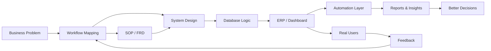

<!--
  GitHub Profile README
  Abhinand / abzops
  Style: Pure Markdown Command Center
  No hero image. No asset folder. No reference-style banner.
-->

<div align="center">

# ⚡ ABHINAND

### AI Operations Architect · ERP Automation · Systems Builder

```txt
Building intelligent systems that automate operations,
streamline workflows, and convert business chaos into execution-ready software.
```

[LinkedIn](https://linkedin.com/in/abzops) · [Email](mailto:opsintern@stacknstock.in) · [GitHub](https://github.com/abzops)

</div>

---

## 🧭 Command Center

<table>
<tr>
<td width="58%" valign="top">

### 👨‍💻 About Me

I’m **Abhinand**, a systems-focused builder working across **AI-assisted development, ERP workflows, automation, procurement systems, inventory management, CRM dashboards, and internal business tools**.

I focus on turning real-world operational problems into **structured, scalable, and automation-ready systems**.

My work usually connects:

- business requirements
- workflow mapping
- ERP logic
- database structure
- dashboards
- automation
- documentation
- AI-assisted execution

> **I don’t just build software screens. I build systems around how people actually work.**

</td>
<td width="42%" valign="top">

### 🧠 System Profile

```yaml
name: Abhinand
github: abzops
role: AI Operations Architect

focus:
  - ERP automation
  - Inventory systems
  - Procurement workflows
  - Internal dashboards
  - AI-assisted development

working_style:
  - map the workflow
  - define the system
  - build the tool
  - automate the repetition
  - improve from feedback
```

</td>
</tr>
</table>

---

## 🧩 What I Build

<table>
<tr>
<td width="25%" align="center" valign="top">

### 📦 IMS

Inventory systems with GRN, MIV, MRN, bin register, stock movement, purchase linkage, dispatch tracking, and traceability.

</td>
<td width="25%" align="center" valign="top">

### ⚙️ ERP

ERPNext, Frappe, Zoho workflows, approval flows, custom module planning, SOPs, FRDs, and implementation logic.

</td>
<td width="25%" align="center" valign="top">

### 📊 Dashboards

CRM, procurement, inventory, and operational dashboards with clean KPI cards, reports, and decision-ready data.

</td>
<td width="25%" align="center" valign="top">

### 🤖 AI Systems

Prompt systems, vibe coding workflows, AI-assisted planning, internal automation, and execution frameworks.

</td>
</tr>
</table>

---

## 🛰️ Operating System Flow



---

## 🛠️ Tech & Tool Stack

<table>
<tr>
<td width="33%" valign="top">

### Languages

```txt
HTML
CSS
JavaScript
TypeScript
Python
SQL
```

</td>
<td width="33%" valign="top">

### Systems & Backend

```txt
Supabase
PostgreSQL
Firebase
Node.js
Express
ERPNext
Frappe
Zoho
```

</td>
<td width="33%" valign="top">

### Tools

```txt
Git
GitHub
VS Code
Postman
Figma
Notion
Docker
Linux
```

</td>
</tr>
</table>

---

## 🏗️ Build Zones

<table>
<tr>
<td width="50%" valign="top">

### 📦 Inventory System Logic

```txt
GRN  -> Stock In
MIV  -> Material Issue
MRN  -> Material Return
WIP  -> Conversion Tracking
BIN  -> Location-Level Control
PO   -> Purchase Linkage
```

Every stock movement should be traceable.  
Every purchase should connect to operations.  
Every dashboard should show what matters.

</td>
<td width="50%" valign="top">

### ⚙️ ERP Automation Logic

```txt
Requirement -> Workflow
Workflow    -> Module
Module      -> Data Model
Data Model  -> UI
UI          -> Automation
Automation  -> Report
Report      -> Decision
```

The goal is not only to create software.  
The goal is to create an operating system for the business.

</td>
</tr>
</table>

---

## 📌 Focus Areas

| Area | What I Work On |
|---|---|
| **ERP Systems** | Custom modules, workflow mapping, FRD/SOP creation |
| **Inventory Systems** | GRN, MIV, MRN, WIP, bin register, stock movement |
| **Procurement Tech** | PO tracking, vendor comparison, sourcing analysis |
| **Automation** | Webhooks, workflow bots, Zoho Flow, Cliq updates |
| **Dashboards** | CRM, IMS, procurement reports, operational KPIs |
| **AI Implementation** | Prompt workflows, AI planning, vibe coding systems |

---

## 🧪 My Build Method

<table>
<tr>
<td width="20%" align="center">

### 01

**Understand**

Find the real workflow, users, pain points, approvals, and data gaps.

</td>
<td width="20%" align="center">

### 02

**Map**

Convert messy operations into a clear step-by-step system flow.

</td>
<td width="20%" align="center">

### 03

**Design**

Define modules, tables, screens, roles, permissions, and reports.

</td>
<td width="20%" align="center">

### 04

**Build**

Create usable tools, dashboards, automations, and documentation.

</td>
<td width="20%" align="center">

### 05

**Improve**

Test with real usage, collect feedback, and make the system stronger.

</td>
</tr>
</table>

---

## 🧠 System Thinking Notes

```txt
Clarity before code.
Workflow before UI.
Data before dashboard.
Automation before repetition.
Execution before perfection.
```

---

## 🚀 Current Mission

```txt
Build intelligent operating systems for growing businesses.

Mission Stack:
01. Digitize manual operations
02. Connect inventory, procurement, ERP, and CRM
03. Automate repetitive workflows
04. Create dashboards that reveal truth
05. Use AI to execute faster and smarter
```

---

## 🌐 Connect

<table>
<tr>
<td width="33%" align="center">

### LinkedIn

[linkedin.com/in/abzops](https://linkedin.com/in/abzops)

</td>
<td width="33%" align="center">

### Email

[opsintern@stacknstock.in](mailto:opsintern@stacknstock.in)

</td>
<td width="33%" align="center">

### GitHub

[github.com/abzops](https://github.com/abzops)

</td>
</tr>
</table>

---

<div align="center">

### ⚡ Final Line

> Great software is not only written.  
> It is architected around how people actually work.

</div>
