

  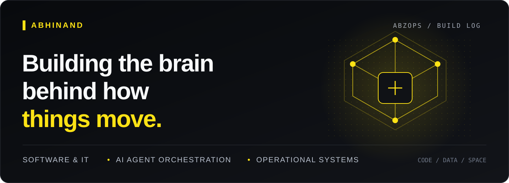

  <strong>Software &amp; IT · AI agent orchestration · Operational systems · Interactive 3D</strong>

  
  <a href="https://github.com/abzops?tab=repositories">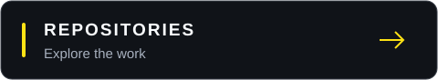</a>

## The work behind the interface

I'm Abhinand. I build software, IT systems, and automation around work that has to move: orders, inventory, budgets, product data, and physical operations.

My workspace has a team in it. Dedicated AI agents, distinct responsibilities, and my own orchestration connecting their work. I set the direction, review the output, and make the pieces work together. The tools help carry the implementation. The responsibility stays with me.

My work also reaches beyond the browser: computer-vision measurement, digital twins, Blender product visualization, and interactive Unity environments working on Windows and macOS.

## Systems I've built

  <a href="https://github.com/abzops/Procurement-Hub">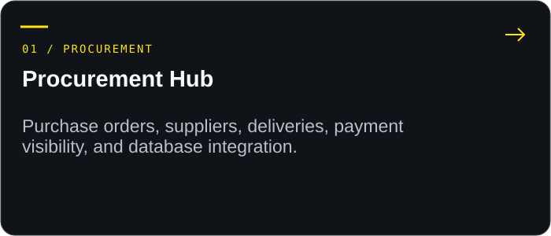</a>
  <a href="https://github.com/abzops/stacknstock-inventory-dashboard">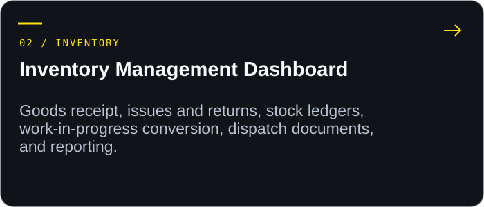</a>

  <a href="https://github.com/abzops/sns-projects">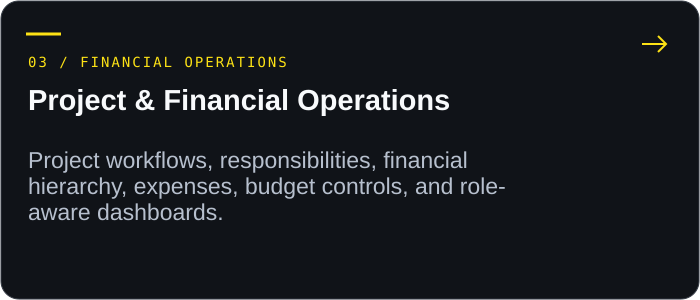</a>
  <a href="https://github.com/abzops/sns-crm">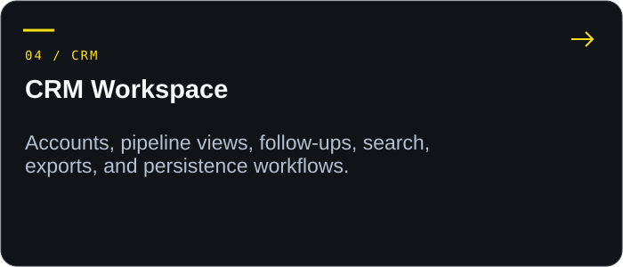</a>

  <a href="https://github.com/abzops/local-ai-sku-dimensioner">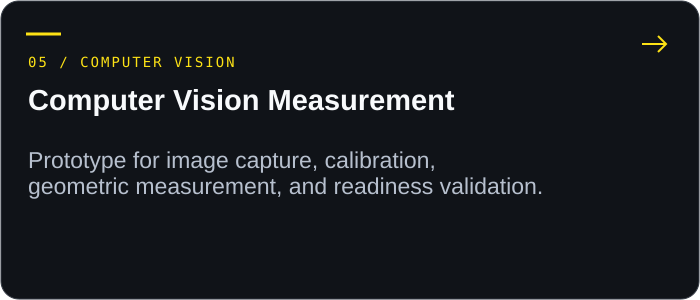</a>
  <a href="https://github.com/abzops/IRFD">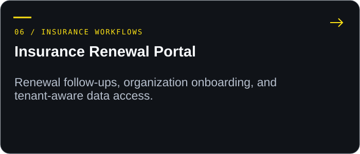</a>

  <a href="https://github.com/abzops/duty-rotator">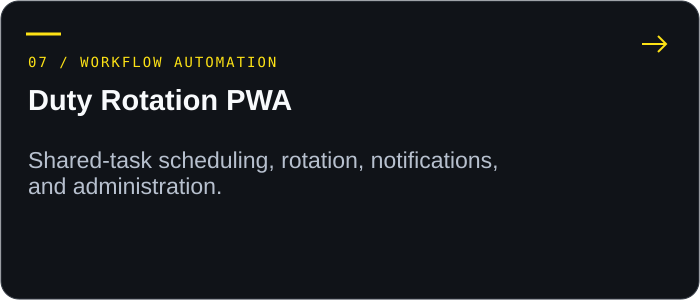</a>
  <a href="https://github.com/abzops/CoReplyApp">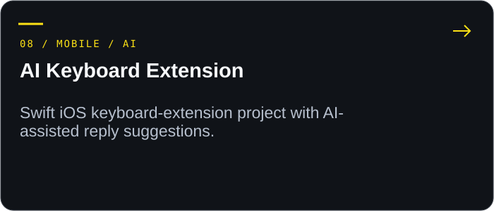</a>

  <a href="https://github.com/abzops/AKOCP">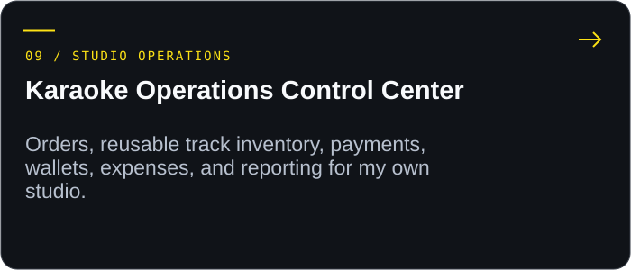</a>
  <a href="https://github.com/abzops/akmate">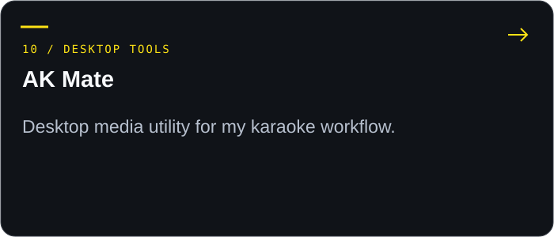</a>

These links represent source projects, not a blanket claim of production readiness. Individual READMEs and release records provide implementation context.

## Websites & platforms

| Repository | Focus |
| --- | --- |
| [Product Website](https://github.com/abzops/StacknStock) | Product storytelling, responsive design, and interactive presentation. |
| [Xelor Freelancing App](https://github.com/abzops/Xelor-Freelancing-App) | Freelancing-platform application work. |
| [Projecthub](https://github.com/abzops/Projecthub) | A lasting showcase for student projects. |
| [Science of Breath](https://github.com/abzops/scienceofbreath.org) | Website and platform development. |
| [Science of Breath Page](https://github.com/abzops/science-of-breath-page) | Web-page and landing-page work. |
| [SOB Online](https://github.com/abzops/sob-online) | Interactive web experience for breathing practice. |

## Beyond the public repositories

- **AI agent team orchestration:** dedicated agents, task coordination, review, and integration across my workflows.
- **Mobile inventory application:** Flutter/Dart, QR scanning, local SQLite storage, and an offline synchronization queue. Source remains private.
- **Digital twin & control simulation:** execution logic, discrete-event simulation, a 3D operational twin, and live telemetry; engineering prototype.
- **Catalogue & storage intelligence:** category taxonomies, packaging dimensions, structured reporting, and bin-packing research.
- **3D product visualization:** Blender modelling, materials, lighting, and rendering.
- **Interactive walkthroughs:** Unity/C# navigation, collisions, doors, and operational interactions; Windows/macOS.
- **Customer analytics:** invoice and customer-data pipelines using Python, DuckDB, and Polars.
- **ERP & IT:** deployment, customization, workflow integration, and workstation administration.
- **Technical communication:** presentation design, programmatic deck generation, and product communication assets.

This section summarizes work without public source at a high level.

## Tools I work with

| Area | Tools |
| --- | --- |
| Applications | JavaScript, TypeScript, React, Next.js, HTML/CSS, Python, Django |
| Data & APIs | PostgreSQL, Supabase, SQLite, FastAPI, DuckDB, Polars |
| Mobile | Flutter, Dart, Swift |
| Vision & simulation | OpenCV, SimPy, Three.js, Unity, C# |
| Product & delivery | Blender, Figma, Git, GitHub Actions, Docker |

## Earlier builds & learning

My earlier repositories show how I learned by building. Clones and exercises are learning work.

| Repository | Context |
| --- | --- |
| [Django Project](https://github.com/abzops/Django-Project) | Project-management admin panel with authentication and project CRUD. |
| [Abhinand](https://github.com/abzops/Abhinand) | Earlier personal portfolio built from a template. |
| [What ToDo Tomorrow](https://github.com/abzops/what-todo-tomorrow) | Early startup web-project exploration. |
| [OLX Clone](https://github.com/abzops/Olx-Clone) | React learning project. |
| [Netflix Clone](https://github.com/abzops/Netflix-Clone) | React learning project. |
| [React ToDo App](https://github.com/abzops/-React-ToDo-App) | Early web-development exercise. |
| [Linkshortner](https://github.com/abzops/Linkshortner) | PHP URL-shortening project. |
| [Facebook Homepage](https://github.com/abzops/Facebook-Homepage) | Early HTML homepage exercise. |
| [Amazon](https://github.com/abzops/Amazon) | Earlier React entertainment/learning experiment; not affiliated with Amazon. |

Forks & template explorations

These repositories started from other authors' work. Attribution and upstream context remain in their repositories.

- [paper-kit-react](https://github.com/abzops/paper-kit-react) — fork of a React UI template.
- [xelor](https://github.com/abzops/xelor) — fork-based template exploration.
- [Ping Static Website](https://github.com/abzops/Ping-Static-Website) — forked static-site exercise.

---

**A database rule. A camera capture. A door inside a simulation.** 
The details change. The responsibility stays with me.
